## 🏠 1) Welcome Screen

The welcome screen features a clean and intuitive layout for users who are not logged in:

- 📚 **Side Navigation Bar** with:
  - Sign Up  
  - Login  
- 🧭 **Top Toolbar** with:
  - Sign Up  
  - Login  

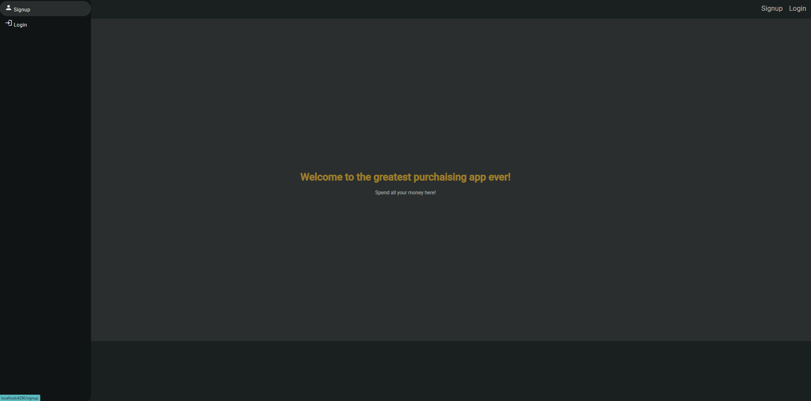

---

## 📝 2) Sign-Up Page

Clicking **Sign Up** opens a registration form requiring the following information:

- 📧 **Email** (input type: `email`)
- 🔒 **Password** (input type: `password`)
- 🧑 **Name**
- 📞 **Phone Number**
- 🏠 **Address**
- 🛍️ **Favorite Product Types**
- 🎂 **Date of Birth** (input type: `date`)
- ✅ **Checkbox** for accepting Terms & Conditions
- 🚀 **Submit Button** (enabled only when all fields are valid)
- 🔙 **Back to Login** link

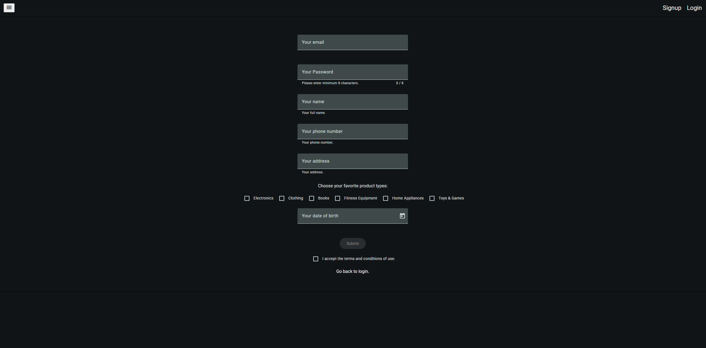

---

## 🔐 3) Logged-In Home Page

Once logged in, users gain access to:

- 🛒 **Cart Button** in the top-right corner → navigates to the **Order Page**
- 💸 **“Spend all your money here”** link → also leads to the **Order Page**
- 📦 **Side Navigation Bar** with:
  - Shopping  
  - Logout  

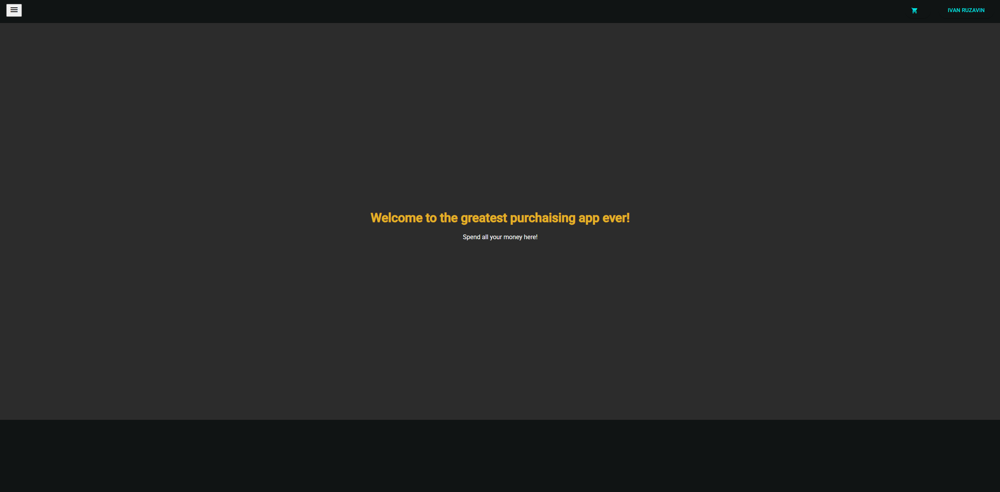

---

## 👤 4) Profile Dialog Window

Accessible by clicking the **user name button** in the top-right corner. The dialog shows:

- All signup data (except password)
- 📝 **Edit** button to update profile info

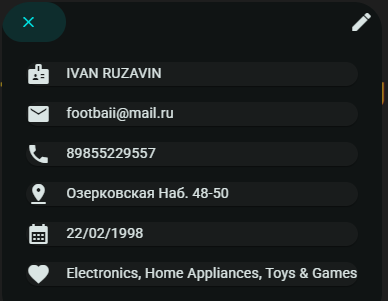

---

## ✏️ 5) Edit Profile Dialog

Allows the user to update their profile information:

- ✍️ Modify any field  
- 💾 **Save User** button to confirm changes

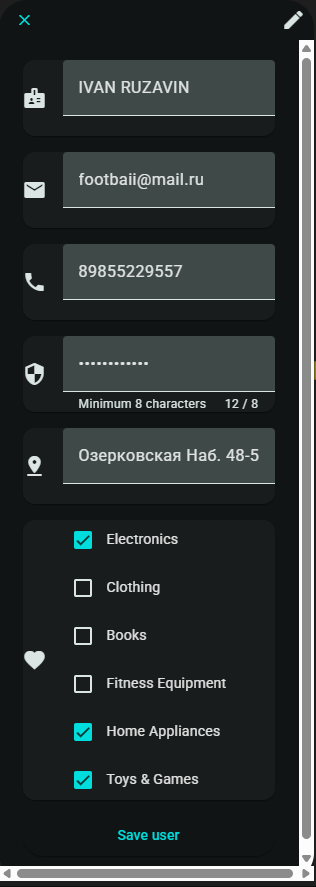

---

## 📦 6) Order Page

Provides a seamless shopping and ordering experience:

- 🆕 **New Order** tab to browse and select products
- 🔍 **Category Filter** for easier product discovery
- 🛒 **Order Button** to place orders
- 🕓 **Order History** tab showing all previous orders
- ⚠️ **Warning Dialog** for confirming new orders

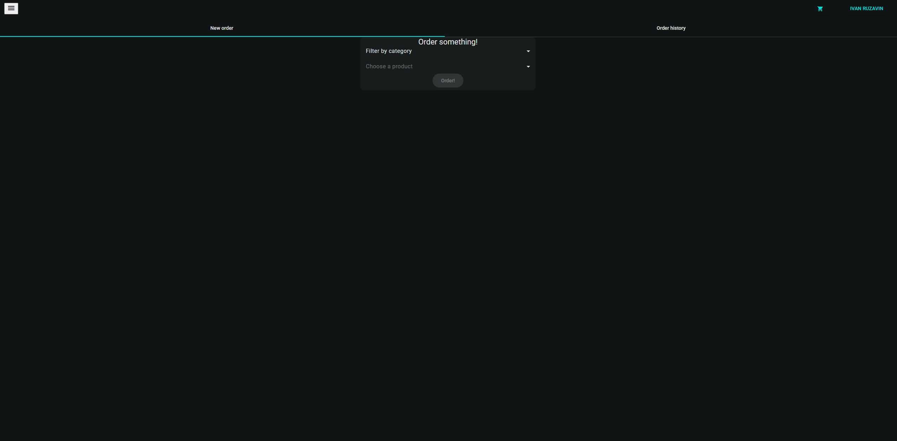  
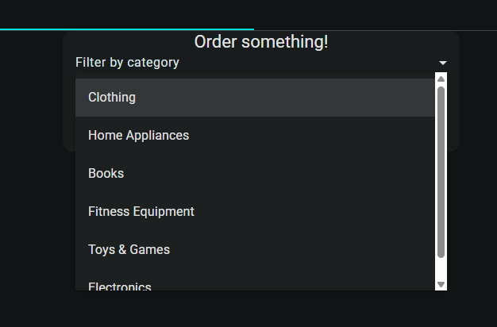  
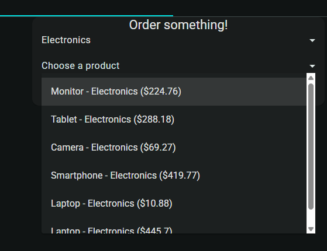  
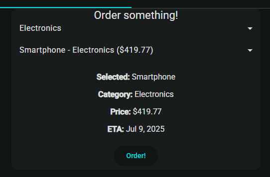  
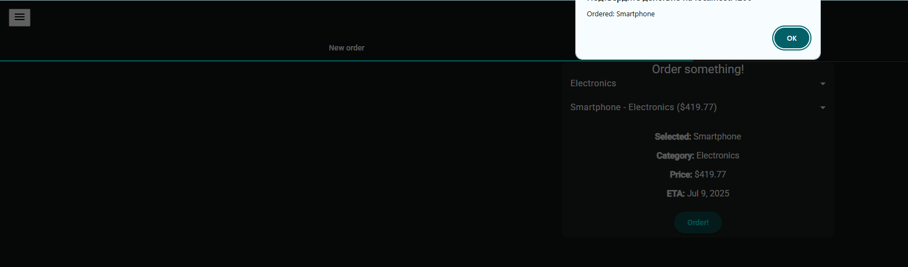  
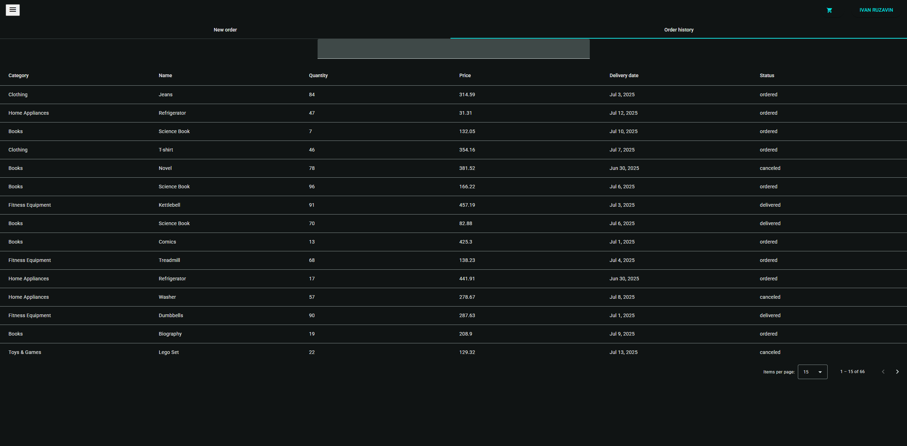
